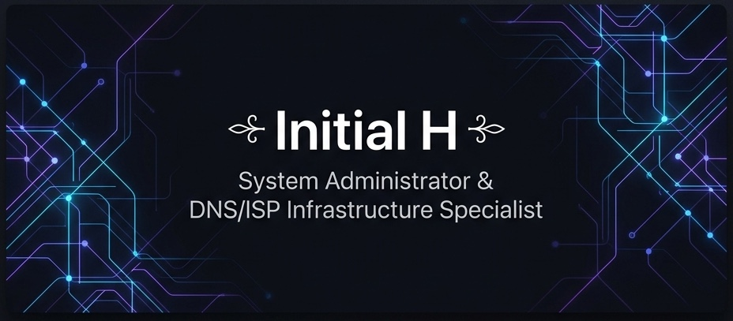

<!-- markdownlint-disable MD033 -->

  

<h2 align="center">System Administrator &amp; DNS/ISP Infrastructure Specialist 🚀</h2>

  
  
  
  
  
  

---

### 📖 About Me

<table border="0" width="100%">
  <tr>
    <td width="60%" valign="top">
      

        Internet addict, Windows, macOS, FreeBSD, and Linux lover. I am a <b>System Administrator & System Engineer</b> (humorously styled as <i>System Administrator Magang</i>) with <b>15+ years of experience</b> specializing in ISP operations, DNS filtering architectures, mail server deployments, hypervisors, and Apple Mac technical support.
      

      

        📍 Based in <b>DKI Jakarta, Indonesia</b>. I build robust, scalable, and secure internet and system solutions.
      

      

        <blockquote><i>ɪɴᴛᴇʀɴᴇᴛ ᴀᴅᴅɪᴄᴛ, ᴡɪɴᴅᴏᴡs, ᴍᴀᴄ, ꜰʀᴇᴇʙsᴅ & ʟɪɴᴜx ʟᴏᴠᴇʀ — ɪ ᴀᴍ ɴᴏᴛ ᴀ ɢᴏᴏᴅ ᴍᴀɴ, ʙᴜᴛ ᴀ ᴍᴀɴ ɪɴ ᴀ ɢᴏᴏᴅ ᴅᴀʏ.</i></blockquote>
      

    </td>
    <td width="40%" valign="top">
      <ul>
        <li>🛠️ <b>Current Role:</b> OpisBoy | Teknisi Mac & Server Keliling | DNS & ISP Infrastructure Specialist</li>
        <li>💬 <b>Ask me about:</b> DNS Filtering, BIND9/PowerDNS, MikroTik RouterOS, Zimbra Mail Server, Proxmox/VMware, and macOS deployments.</li>
        <li>✉️ <b>Email:</b> <a href="mailto:alsyundawy@gmail.com">alsyundawy@gmail.com</a></li>
      </ul>
    </td>
  </tr>
</table>

  
💖 <b>Dukungan QRIS / Support Me</b> (Klik untuk berdonasi / Click to view QRIS)

  

    Jika Anda merasa terbantu dan ingin mendukung proyek ini, pertimbangkan untuk berdonasi melalui QRIS. Terima kasih atas dukungannya! 🙏
      
    
  

---

### 🌐 Live Tools & Services

I host and maintain several public tools and services to assist network engineers and administrators:

| Service / Tool | Description | Status & Link |
| :--- | :--- | :--- |
| 🔍 **Looking Glass** | Enterprise-grade network diagnostic tools | [lg.alsyundawy.com 🔗](https://lg.alsyundawy.com) |
| ⚡ **Looking Glass v2.5** | Advanced diagnostic tool interface | [lg.alsyundawy.com/lgv2.php 🔗](https://lg.alsyundawy.com/lgv2.php) |
| 🌐 **Looking Glass (v2.0)** | Classic Looking Glass | [lg.alsyundawy.com/lg.php 🔗](https://lg.alsyundawy.com/lg.php) |
| 💻 **Looking Glass (v2.1)** | Alternative diagnostic interface | [lg.alsyundawy.com/lgv1.php 🔗](https://lg.alsyundawy.com/lgv1.php) |
| 🐙 **Looking Glass (GitHub)** | Open-source diagnostic version | [lg.alsyundawy.com/lg-github.php 🔗](https://lg.alsyundawy.com/lg-github.php) |
| 📡 **MultiPing** | MultiPing Location latency tests | [lg.alsyundawy.com/multiping.php 🔗](https://lg.alsyundawy.com/multiping.php) |
| 🚀 **SpeedTest** | High-performance HTML5 speed check | [speedtest.alsyundawy.com 🔗](https://speedtest.alsyundawy.com/) |
| 🛡️ **RBL Checker** | Real-time email blacklist checker | [rbl.alsyundawy.com 🔗](https://rbl.alsyundawy.com/) |
| 🚦 **TrustPositif Check** | Check domains against Kominfo blacklist | [trustcheck.alsyundawy.com 🔗](https://trustcheck.alsyundawy.com/) |
| 🗺️ **DNS Checker** | Global DNS propagation tool | [dnschecker.alsyundawy.com 🔗](https://dnschecker.alsyundawy.com/) |
| 📦 **Custom Repository** | Personal repo hosting configuration files & packages | [repo.alsyundawy.com 🔗](https://repo.alsyundawy.com/) |

---

### 🛠️ Technical Expertise

#### 🛜 ISP Hardware & System Infrastructure

  
  
  
  
  

- **Management:** Server hardware installation, MikroTik RouterOS deployment, bandwidth optimization, and VPN networking (WireGuard, OpenVPN).
- **Monitoring:** Smokeping, Uptime Kuma, Cacti, PRTG, Nagios, Zabbix, MRTG, Grafana, and Netdata with sub-minute intervals.

#### 🔒 DNS Filtering & Security (TrustPositif)

  
  
  
  

- **Engines:** PowerDNS, BIND9, Unbound, and Knot DNS.
- **RPZ Specialist:** Expert implementation of Response Policy Zone (RPZ) DNS firewalls and TrustPositif database (Kementerian Kominfo RI) conversion.

#### ☁️ Hypervisors & Virtualization

  
  
  
  

- **Platforms:** Proxmox VE, VMware ESXi/vSphere/vCenter, KVM, Hyper-V, QEMU.
- **Orchestration:** High-Availability (HA) clustering, live VM migrations, resource tuning, and VM backup strategies.

#### ✉️ Mail, SMTP Systems & Hosting Services

  
  
  
  

- **Platforms:** Zimbra Collaboration Suite, Proxmox Mail Gateway, WHM/cPanel, Postfix, Dovecot.
- **Securing Mail:** DKIM, SPF, DMARC alignment, Rspamd, SpamAssassin, ClamAV, and custom anti-spam filters.

#### 🍎 Apple Mac Services & Deployment

  
  

- **Expertise:** Certified macOS installation, diagnostic operations, hardware upgrades, and enterprise integration (Apple Silicon M1/M2/M3 optimization).

---

### 🚀 Highlighted Repositories

#### 🛡️ DNS & TrustPositif Tools
- 📦 **[TrustPositif-To-RPZ-Binary](https://github.com/alsyundawy/TrustPositif-To-RPZ-Binary)**   
  *Converts Kominfo TrustPositif domains into DNS RPZ format. Features whitelist & Google SafeSearch helper.*  
  `Go` `DNS` `RPZ` `Blocklist`
- 📦 **[TrustPositif](https://github.com/alsyundawy/TrustPositif)**   
  *Comprehensive raw TrustPositif domain database with daily automated updates.*  
  `Database` `Kominfo` `Blocklist`
- 📦 **[TrustPositif-Validator](https://github.com/alsyundawy/TrustPositif-Validator)**   
  *High-performance domain validation and aggregation pipeline for TrustPositif/Komdigi and public blocklists. ShellCheck Certified.*  
  `Shell` `Validator` `RFC-Compliant` `Punycode`
- 📦 **[sunat-trustpositif](https://github.com/alsyundawy/sunat-trustpositif)**   
  *Shell script that validates domain lists against official TLDs and cleanses database records.*  
  `Shell` `TLD` `Data-Cleansing`
- 📦 **[StevenBlack-Host-RPZ](https://github.com/alsyundawy/StevenBlack-Host-RPZ)**   
  *Converts the StevenBlack host lists to DNS RPZ format.*  
  `DNS` `RPZ` `StevenBlack`
- 📦 **[dns-blocklists](https://github.com/alsyundawy/dns-blocklists)**   
  *Fork of Hagezi DNS-Blocklists for safe browsing.*  
  `DNS` `Blocklist` `Hagezi`
- 📦 **[Sefinek-Blocklist-Collection](https://github.com/alsyundawy/Sefinek-Blocklist-Collection)**   
  *A comprehensive compilation of block lists for Pi-hole and AdGuard with over 5 million domains.*  
  `Pi-hole` `AdGuard` `Blocklist`

#### 🖥️ Diagnostics & Network Tools
- 📦 **[php-looking-glass](https://github.com/alsyundawy/php-looking-glass)**   
  *A professional, secure, single-file PHP Looking Glass for network diagnostics (Ping, Traceroute, MTR, WHOIS, DNS Lookup, Iperf3).*  
  `PHP` `Network` `Looking-Glass` `MTR`
- 📦 **[MIKROTIK-SCRIPT](https://github.com/alsyundawy/MIKROTIK-SCRIPT)**   
  *Curated collection of useful Mikrotik scripting automations.*  
  `RouterOS` `MikroTik` `Automation`
- 📦 **[mikrotik-blacklist](https://github.com/alsyundawy/mikrotik-blacklist)**   
  *RouterOS scripts for automated threat intelligence blacklist updates.*  
  `RouterOS` `Blacklist` `Security`
- 📦 **[bind-acl-indonesia-openixp](https://github.com/alsyundawy/bind-acl-indonesia-openixp)**   
  *Automatically generates Indonesian IP ACL files for BIND9 DNS using Nice.rsc and APNIC.*  
  `BIND9` `ACL` `OpenIXP` `APNIC`
- 📦 **[dnsperftest](https://github.com/alsyundawy/dnsperftest)**   
  *Comprehensive DNS benchmark and latency evaluation tool.*  
  `DNS` `Benchmark` `Latency`
- 📦 **[ufw-ipset-blocklist-autoupdate](https://github.com/alsyundawy/ufw-ipset-blocklist-autoupdate)**   
  *Automatically updates IP blocking lists via ipset and ufw firewalls.*  
  `UFW` `Ipset` `Security`
- 📦 **[PowerDNS-Zone-Backups](https://github.com/alsyundawy/PowerDNS-Zone-Backups)**   
  *Automated PowerDNS zone backup solution with incremental backups.*  
  `PowerDNS` `Backup` `Database`

#### 📦 System Tools & macOS Automations
- 📦 **[Microsoft-Office-For-MacOS](https://github.com/alsyundawy/Microsoft-Office-For-MacOS)**   
  *Complete Mac installer bundle for Microsoft Office (Intel/Apple Silicon) with LTSC serializer.*  
  `macOS` `Installer` `Office` `Apple-Silicon`
- 📦 **[skipmdm-bypass](https://github.com/alsyundawy/skipmdm-bypass)**   
  *Automatic MDM bypass scripts for Monterey, Ventura, and Sonoma macOS.*  
  `macOS` `MDM-Bypass` `Shell`
- 📦 **[File-Directory-Browser](https://github.com/alsyundawy/File-Directory-Browser)**   
  *PHP File browser featuring advanced security (CSRF protection, output sanitization, hash checks).*  
  `PHP` `Security` `File-Manager`
- 📦 **[Zimbra-Clean-Spam](https://github.com/alsyundawy/Zimbra-Clean-Spam)**   
  *Scan and purge spam email queues caused by compromised accounts.*  
  `Zimbra` `Mail-Server` `Spam-Cleaner`
- 📦 **[uninstall-zimbra](https://github.com/alsyundawy/uninstall-zimbra)**   
  *Complete Bash utility to clean-uninstall Zimbra instances from Linux.*  
  `Zimbra` `Uninstaller` `Bash`
- 📦 **[NotepadNext-MacOS](https://github.com/alsyundawy/NotepadNext-MacOS)**   
  *Reimplementation of Notepad++ for macOS.*  
  `macOS` `NotepadNext` `Editor`
- 📦 **[XiaomiADBFastbootTools-Win32](https://github.com/alsyundawy/XiaomiADBFastbootTools-Win32)**   
  *ADB and fastboot tools optimized for Xiaomi devices on Windows.*  
  `Windows` `ADB` `Fastboot` `Xiaomi`

---

### 📊 GitHub Analytics

  
  

  
  

  

---

<b>📋 Documentation Notes & Changelog</b>

### Version 2.2.0 (July 19, 2026)
- **Visual Rebranding**: Added a custom, modern high-tech dark theme banner at the top (`banner.png`).
- **Aesthetic Refinement**: Redesigned layout to utilize a professional double-column introduction.
- **Collapsible QRIS**: Moved the QRIS donation layout into an elegant collapsible section to keep the main landing view clean.
- **Dynamic Repository Badges**: Added live shields.io GitHub Star badges to all highlighted repositories.
- **Unified Analytics**: Standardized all GitHub summary, streak, stats, and language cards to the modern `tokyonight` theme and aligned them in a responsive layout.
- **Interactive Emojis**: Replaced basic bullets with expressive, attractive, and professional emojis.

### Version 2.1.0 (July 5, 2026)
- **Expanded Profile Data**: Integrated additional background and details from `alsyundawy.com`, including the user's self-styled identity as *System Administrator Magang / OpisBoy / Teknisi Mac & Server Keliling*.
- **Comprehensive Repository Expansion**: Scraped GitHub and added missing highly starred and notable projects (`MIKROTIK-SCRIPT`, `CleanMyMacX-MAS`, `dns-blocklists`, `Sefinek-Blocklist-Collection`, `skipmdm-bypass`, `ufw-ipset-blocklist-autoupdate`, `PowerDNS-Zone-Backups`, `NotepadNext-MacOS`, `XiaomiADBFastbootTools-Win32`).
- **Looking Glass Mirrors**: Added the multiple Looking Glass version endpoints (v2.0, v2.1, and GitHub version) in the live services table.
- **Mirror & Counter Patch**: Replaced rate-limited endpoints for *Top Languages*, *Trophies*, and *Visitor Count* with active, verified service endpoints (`github-readme-stats-sigma-five`, `github-profile-trophy-unserori`, and `komarev-ghpvc`).
- **Restored Components**: Restored the original QRIS donation graphic and the Star History chart.
- **Markdown Linting**: Resolved standard validation issues including heading level structure, list formats, and margin spacing.
- **Aesthetic Refinement**: Re-organized contact badges and technical categories to follow modern responsive practices.

---

  

  <i>You Are Awesome • ༺ Harry DS Alsyundawy ༻ • Hardline & Militant Lying Around</i>

