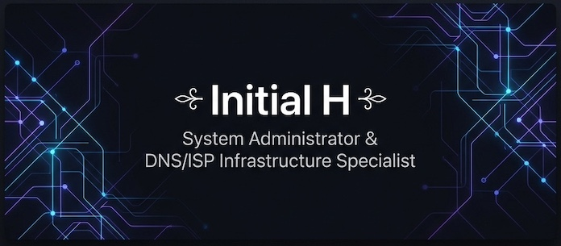

<!-- markdownlint-disable MD033 MD041 -->

  

<h2 align="center">System Administrator &amp; DNS/ISP Infrastructure Specialist 🚀</h2>

  
  
  
  
  
  
  

---

### 📖 About Me

<table border="0" width="100%">
  <tr>
    <td width="60%" valign="top">
      

        Internet addict, Windows, macOS, FreeBSD, and Linux lover. I am a <b>System Administrator & System Engineer</b> (humorously styled as <i>System Administrator Magang</i>) with <b>15+ years of experience</b> specializing in ISP operations, DNS filtering architectures, mail server deployments, hypervisors, and Apple Mac technical support.
      

      

        📍 Based in <b>DKI Jakarta, Indonesia</b>. I build robust, scalable, and secure internet and system solutions.
      

      

        <blockquote><i>ɪɴᴛᴇʀɴᴇᴛ ᴀᴅᴅɪᴄᴛ, ᴡɪɴᴅᴏᴡs, ᴍᴀᴄ, ꜰʀᴇᴇʙsᴅ & ʟɪɴᴜx ʟᴏᴠᴇʀ — ɪ ᴀᴍ ɴᴏᴛ ᴀ ɢᴏᴏᴅ ᴍᴀɴ, ʙᴜᴛ ᴀ ᴍᴀɴ ɪɴ ᴀ ɢᴏᴏᴅ ᴅᴀʏ.</i></blockquote>
      

    </td>
    <td width="40%" valign="top">
      <ul>
        <li>🛠️ <b>Current Role:</b> OpisBoy | Teknisi Mac & Server Keliling | DNS & ISP Infrastructure Specialist</li>
        <li>💬 <b>Ask me about:</b> DNS Filtering, BIND9/PowerDNS, MikroTik RouterOS, Zimbra Mail Server, Proxmox/VMware, and macOS deployments.</li>
        <li>✉️ <b>Email:</b> <a href="mailto:alsyundawy@gmail.com">alsyundawy@gmail.com</a></li>
      </ul>
    </td>
  </tr>
</table>

  
💖 <b>Dukungan QRIS / Support Me</b> (Klik untuk berdonasi / Click to view QRIS)

  

    Jika Anda merasa terbantu dan ingin mendukung proyek ini, pertimbangkan untuk berdonasi melalui QRIS. Terima kasih atas dukungannya! 🙏
      
    
  

---

### 🌐 Live Tools & Services

I host and maintain several public tools and services to assist network engineers and administrators:

| Service / Tool | Description | Status & Link |
| :--- | :--- | :--- |
| 🔍 **Looking Glass** | Enterprise-grade network diagnostic tools | [lg.alsyundawy.com 🔗](https://lg.alsyundawy.com) |
| ⚡ **Looking Glass v2.5** | Advanced diagnostic tool interface | [lg.alsyundawy.com/lgv2.php 🔗](https://lg.alsyundawy.com/lgv2.php) |
| 🌐 **Looking Glass (v2.0)** | Classic Looking Glass | [lg.alsyundawy.com/lg.php 🔗](https://lg.alsyundawy.com/lg.php) |
| 💻 **Looking Glass (v2.1)** | Alternative diagnostic interface | [lg.alsyundawy.com/lgv1.php 🔗](https://lg.alsyundawy.com/lgv1.php) |
| 🐙 **Looking Glass (GitHub)** | Open-source diagnostic version | [lg.alsyundawy.com/lg-github.php 🔗](https://lg.alsyundawy.com/lg-github.php) |
| 📡 **MultiPing** | MultiPing Location latency tests | [lg.alsyundawy.com/multiping.php 🔗](https://lg.alsyundawy.com/multiping.php) |
| 🛡️ **Open DNS Scanner** | Public DNS Open Resolver auditor, DDoS amplification analysis & DNSSEC validator | [lg.alsyundawy.com/resolver.php 🔗](https://lg.alsyundawy.com/resolver.php) |
| 🚀 **SpeedTest** | High-performance HTML5 speed check | [speedtest.alsyundawy.com 🔗](https://speedtest.alsyundawy.com/) |
| 🛡️ **RBL Checker** | Real-time email blacklist checker | [rbl.alsyundawy.com 🔗](https://rbl.alsyundawy.com/) |
| 🚦 **TrustPositif Check** | Check domains against Kominfo blacklist | [trustcheck.alsyundawy.com 🔗](https://trustcheck.alsyundawy.com/) |
| 🗺️ **DNS Checker** | Global DNS propagation tool | [dnschecker.alsyundawy.com 🔗](https://dnschecker.alsyundawy.com/) |
| 📦 **Custom Repository** | Personal repo hosting configuration files & packages | [repo.alsyundawy.com 🔗](https://repo.alsyundawy.com/) |

---

### 📚 Technical Guides & Tutorials

Curated enterprise tutorials, server architectures, and deployment guides from [alsyundawy.com](https://alsyundawy.com):

| Category | Tutorial / Guide | Description | Read Guide |
| :--- | :--- | :--- | :--- |
| ✉️ **Mail Systems** | **Build Zimbra FOSS** | Panduan build Zimbra Collaboration 10.1.x FOSS dari source (zm-build) untuk Ubuntu 24.04 & Rocky 9 | [alsyundawy.com 🔗](https://alsyundawy.com/Build-Zimbra-FOSS.html) |
| ✉️ **Mail Systems** | **Install Zimbra FOSS** | Instalasi Zimbra Collaboration 10.1.x FOSS di Ubuntu Server 24.04 LTS & Rocky Linux 9 / AlmaLinux 9 | [alsyundawy.com 🔗](https://alsyundawy.com/Install-Zimbra-FOSS.html) |
| 🔒 **DNS & RPZ** | **TrustPositif To RPZ Binary** | Implementasi BIND9 DNS Filtering dengan RPZ TrustPositif Komdigi RI, WhiteList & Google SafeSearch | [alsyundawy.com 🔗](https://alsyundawy.com/TrustPositif-RPZ-Install.html) |
| 🔒 **DNS & RPZ** | **PowerDNS-Admin (Debian 13)** | Konfigurasi Master-Slave PowerDNS Authoritative dengan PowerAdmin untuk redundansi DNS ISP | [alsyundawy.com 🔗](https://alsyundawy.com/PowerDNS-Admin-Debian.html) |
| 🔒 **DNS & RPZ** | **PowerDNS-Admin (Ubuntu 22.04)** | Otomatisasi & deployment PowerDNS Authoritative MariaDB dengan PowerDNS-Admin Flask Web UI | [alsyundawy.com 🔗](https://alsyundawy.com/PowerDNS-Admin-Ubuntu.html) |
| 🔒 **DNS & RPZ** | **PHP PowerAdmin** | PowerDNS Authoritative dengan Poweradmin UI untuk zone management, DNSSEC, dan REST API | [alsyundawy.com 🔗](https://alsyundawy.com/PowerAdmin.html) |
| ☁️ **Hypervisors** | **Proxmox VE 9** | Panduan instalasi dan konfigurasi Proxmox VE 9 pada Debian/Ubuntu: cluster, storage, VM & LXC | [alsyundawy.com 🔗](https://alsyundawy.com/Proxmox-VE-9.html) |
| ☁️ **Hypervisors** | **vSphere Unsupported HW** | Instalasi dan upgrade VMware vSphere / ESXi pada hardware server yang tidak didukung secara resmi | [alsyundawy.com 🔗](https://alsyundawy.com/vSphere.html) |
| 📊 **Monitoring** | **Prometheus & Grafana** | Monitoring infrastruktur lengkap dengan Prometheus, Node Exporter, Grafana & Zabbix 7.0 LTS | [alsyundawy.com 🔗](https://alsyundawy.com/Prometheus-Grafana-Debian.html) |
| 📊 **Monitoring** | **Cacti Monitoring Stack** | Instalasi Cacti network graphing tool pada Debian dengan Apache/Nginx pada root domain | [alsyundawy.com 🔗](https://alsyundawy.com/Cacti.html) |
| 🛜 **Network & Tools** | **HyperGlass** | BGP Looking Glass modern Python dengan integrasi BIRD, FRR, OpenBGPD, Nginx reverse proxy & Redis | [alsyundawy.com 🔗](https://alsyundawy.com/HyperGlass.html) |
| 🛜 **Network & Tools** | **PHP-LookingGlass** | Alat diagnostik jaringan single-file PHP untuk ping, traceroute, BGP route lookup & DNS resolution | [alsyundawy.com 🔗](https://alsyundawy.com/PHP-LookingGlass.html) |
| 🛜 **Network & Tools** | **phpIPAM** | phpIPAM IP Address Management untuk alokasi IP, VLAN, subnetting, dan scanning jaringan otomatis | [alsyundawy.com 🔗](https://alsyundawy.com/phpIPAM.html) |
| 🛡️ **VPN & Security** | **OpenVPN Road Warrior** | Deployment OpenVPN Road Warrior dual-stack IPv4/IPv6 dengan Unbound DNS resolver & security hardening | [alsyundawy.com 🔗](https://alsyundawy.com/OpenVPN-Install.html) |
| 🚀 **ISP Services** | **Ookla Speedtest Server** | Deployment Ookla Speedtest Server produksi dengan konfigurasi Dual-Stack IPv4 & IPv6 dan systemd | [alsyundawy.com 🔗](https://alsyundawy.com/Ookla-Speedtest.html) |
| 📡 **PTT & Telephony** | **WalkieFleet Server** | Panduan lengkap instalasi WalkieFleet Push-to-Talk (PTT) server pada Linux Debian & Ubuntu | [alsyundawy.com 🔗](https://alsyundawy.com/WalkieFleet.html) |

---

### 🛠️ Technical Expertise

#### 🛜 ISP Hardware & System Infrastructure

  
  
  
  
  

- **Management:** Server hardware installation, MikroTik RouterOS deployment, bandwidth optimization, and VPN networking (WireGuard, OpenVPN).
- **Monitoring:** Smokeping, Uptime Kuma, Cacti, PRTG, Nagios, Zabbix, MRTG, Grafana, and Netdata with sub-minute intervals.

#### 🔒 DNS Filtering & Security (TrustPositif)

  
  
  
  

- **Engines:** PowerDNS, BIND9, Unbound, and Knot DNS.
- **RPZ Specialist:** Expert implementation of Response Policy Zone (RPZ) DNS firewalls and TrustPositif database (Kementerian Kominfo RI) conversion.

#### ☁️ Hypervisors & Virtualization

  
  
  
  

- **Platforms:** Proxmox VE, VMware ESXi/vSphere/vCenter, KVM, Hyper-V, QEMU.
- **Orchestration:** High-Availability (HA) clustering, live VM migrations, resource tuning, and VM backup strategies.

#### ✉️ Mail, SMTP Systems & Hosting Services

  
  
  
  

- **Platforms:** Zimbra Collaboration Suite, Proxmox Mail Gateway, WHM/cPanel, Postfix, Dovecot.
- **Securing Mail:** DKIM, SPF, DMARC alignment, Rspamd, SpamAssassin, ClamAV, and custom anti-spam filters.

#### 🍎 Apple Mac Services & Deployment

  
  

- **Expertise:** Certified macOS installation, diagnostic operations, hardware upgrades, and enterprise integration (Apple Silicon M1/M2/M3 optimization).

---

### 🚀 Highlighted Repositories

#### 🛡️ DNS & TrustPositif Tools

- 📦 **[TrustPositif-To-RPZ-Binary](https://github.com/alsyundawy/TrustPositif-To-RPZ-Binary)**  
  *Converts Kominfo TrustPositif domains into DNS RPZ format. Features whitelist & Google SafeSearch helper.* 
  `Go` `DNS` `RPZ` `Blocklist`
- 📦 **[TrustPositif](https://github.com/alsyundawy/TrustPositif)**  
  *Comprehensive raw TrustPositif domain database with daily automated updates.* 
  `Database` `Kominfo` `Blocklist`
- 📦 **[TrustPositif-Validator](https://github.com/alsyundawy/TrustPositif-Validator)**  
  *High-performance domain validation and aggregation pipeline for TrustPositif/Komdigi and public blocklists. ShellCheck Certified.* 
  `Shell` `Validator` `RFC-Compliant` `Punycode`
- 📦 **[sunat-trustpositif](https://github.com/alsyundawy/sunat-trustpositif)**  
  *Shell script that validates domain lists against official TLDs and cleanses database records.* 
  `Shell` `TLD` `Data-Cleansing`
- 📦 **[StevenBlack-Host-RPZ](https://github.com/alsyundawy/StevenBlack-Host-RPZ)**  
  *Converts the StevenBlack host lists to DNS RPZ format.* 
  `DNS` `RPZ` `StevenBlack`
- 📦 **[dns-blocklists](https://github.com/alsyundawy/dns-blocklists)**  
  *Fork of Hagezi DNS-Blocklists for safe browsing.* 
  `DNS` `Blocklist` `Hagezi`
- 📦 **[Sefinek-Blocklist-Collection](https://github.com/alsyundawy/Sefinek-Blocklist-Collection)**  
  *A comprehensive compilation of block lists for Pi-hole and AdGuard with over 5 million domains.* 
  `Pi-hole` `AdGuard` `Blocklist`

#### 🖥️ Diagnostics & Network Tools

- 📦 **[php-looking-glass](https://github.com/alsyundawy/php-looking-glass)**  
  *A professional, secure, single-file PHP Looking Glass for network diagnostics (Ping, Traceroute, MTR, WHOIS, DNS Lookup, Iperf3).* 
  `PHP` `Network` `Looking-Glass` `MTR`
- 📦 **[visualsubnetcalc](https://github.com/alsyundawy/visualsubnetcalc)**  
  *Visual Subnet Calculator — Modernized & Hardened Edition. Visual, interactive IPv4 subnet calculator and network design utility with real-time bit splitting, CIDR calculations, and network mapping.* 
  `TypeScript` `Networking` `Subnetting` `IPv4` `CIDR`
- 📦 **[MIKROTIK-SCRIPT](https://github.com/alsyundawy/MIKROTIK-SCRIPT)**  
  *Curated collection of useful Mikrotik scripting automations.* 
  `RouterOS` `MikroTik` `Automation`
- 📦 **[mikrotik-blacklist](https://github.com/alsyundawy/mikrotik-blacklist)**  
  *RouterOS scripts for automated threat intelligence blacklist updates.* 
  `RouterOS` `Blacklist` `Security`
- 📦 **[bind-acl-indonesia-openixp](https://github.com/alsyundawy/bind-acl-indonesia-openixp)**  
  *Automatically generates Indonesian IP ACL files for BIND9 DNS using Nice.rsc and APNIC.* 
  `BIND9` `ACL` `OpenIXP` `APNIC`
- 📦 **[dnsperftest](https://github.com/alsyundawy/dnsperftest)**  
  *Comprehensive DNS benchmark and latency evaluation tool.* 
  `DNS` `Benchmark` `Latency`
- 📦 **[ufw-ipset-blocklist-autoupdate](https://github.com/alsyundawy/ufw-ipset-blocklist-autoupdate)**  
  *Automatically updates IP blocking lists via ipset and ufw firewalls.* 
  `UFW` `Ipset` `Security`
- 📦 **[PowerDNS-Zone-Backups](https://github.com/alsyundawy/PowerDNS-Zone-Backups)**  
  *Automated PowerDNS zone backup solution with incremental backups.* 
  `PowerDNS` `Backup` `Database`

#### ✉️ Mail Server & Zimbra Ecosystem

- 📦 **[eradicate-zimbra-malware](https://github.com/alsyundawy/eradicate-zimbra-malware)**  
  *Enterprise Forensic Incident Response, Anti-Ransomware, Polyglot Webshell Quarantine & Zimbra Permission Healing Suite.* 
  `Shell` `Security` `Forensics` `Zimbra` `Incident-Response`
- 📦 **[Zimbra-Link-Installer](https://github.com/alsyundawy/Zimbra-Link-Installer)**  
  *The Complete Zimbra Collaboration Archive & Installer Suite. Direct binary downloads, official & community builds, cryptographic checksums, and automated CLI installer (ZCS 4.5.x – 10.1.x).* 
  `Shell` `HTML` `Zimbra` `Installer` `Mail-Server`
- 📦 **[Zimbra2Zimbra-Migration-Tool](https://github.com/alsyundawy/Zimbra2Zimbra-Migration-Tool)**  
  *Z2Z — Zimbra to Zimbra Migration Suite. Enterprise zero-timeout, cross-version, and zero-data-loss migration engine for Zimbra Collaboration Suite (ZCS 7.x – 10.1.x) & Carbonio CE.* 
  `Shell` `Zimbra` `Migration` `Backup` `Mail-Server`
- 📦 **[zmbackup](https://github.com/alsyundawy/zmbackup)**  
  *Enterprise Multi-Threaded Hot Backup, Zero-Timeout Restore, Cross-OS Migration Engine & Security Hardening for Zimbra Collaboration Suite (ZCS 7.0–10.1.x Daffodil) & Carbonio FOSS.* 
  `Shell` `Zimbra` `Backup` `Disaster-Recovery` `Migration`
- 📦 **[Z2C (Zimbra to Carbonio Migration)](https://github.com/alsyundawy/Z2C)**  
  *Zimbra to Carbonio Migration tool. A set of scripts to export domains, accounts, aliases, and mailboxes, supporting parallel migration.* 
  `Shell` `Zimbra` `Carbonio` `Migration`
- 📦 **[Zimbra-Clean-Spam](https://github.com/alsyundawy/Zimbra-Clean-Spam)**  
  *Scan and purge spam email queues caused by compromised accounts.* 
  `Zimbra` `Mail-Server` `Spam-Cleaner`
- 📦 **[uninstall-zimbra](https://github.com/alsyundawy/uninstall-zimbra)**  
  *Complete Bash utility to clean-uninstall Zimbra instances from Linux.* 
  `Zimbra` `Uninstaller` `Bash`

#### ☁️ Hypervisors, macOS & System Utilities

- 📦 **[esxi-unlocker-v4](https://github.com/alsyundawy/esxi-unlocker-v4)**  
  *macOS Unlocker V4 for VMware ESXi. Enables Apple macOS guest support on VMware ESXi hypervisors with maintained shell/Python patching workflow and VMware Tools integration.* 
  `Python` `VMware` `ESXi` `macOS` `Hypervisor`
- 📦 **[Microsoft-Office-For-MacOS](https://github.com/alsyundawy/Microsoft-Office-For-MacOS)**  
  *Complete Mac installer bundle for Microsoft Office (Intel/Apple Silicon) with LTSC serializer.* 
  `macOS` `Installer` `Office` `Apple-Silicon`
- 📦 **[skipmdm-bypass](https://github.com/alsyundawy/skipmdm-bypass)**  
  *Automatic MDM bypass scripts for Monterey, Ventura, and Sonoma macOS.* 
  `macOS` `MDM-Bypass` `Shell`
- 📦 **[shc](https://github.com/alsyundawy/shc)**  
  *Generic Shell Script Compiler with Enhanced Security & Auditing. Encrypts and compiles shell scripts into stripped binary executables.* 
  `C` `Shell` `Security` `Auditing` `Hardening`
- 📦 **[File-Directory-Browser](https://github.com/alsyundawy/File-Directory-Browser)**  
  *PHP File browser featuring advanced security (CSRF protection, output sanitization, hash checks).* 
  `PHP` `Security` `File-Manager`
- 📦 **[NotepadNext-MacOS](https://github.com/alsyundawy/NotepadNext-MacOS)**  
  *Reimplementation of Notepad++ for macOS.* 
  `macOS` `NotepadNext` `Editor`
- 📦 **[XiaomiADBFastbootTools-Win32](https://github.com/alsyundawy/XiaomiADBFastbootTools-Win32)**  
  *ADB and fastboot tools optimized for Xiaomi devices on Windows.* 
  `Windows` `ADB` `Fastboot` `Xiaomi`

---

### 📊 GitHub Analytics

  
  

  
  

  

---

<b>📋 Documentation Notes & Changelog</b>

### Version 2.3.0 (September 17, 2026)

- **Repository Additions & Reorganization**: Integrated `visualsubnetcalc`, `esxi-unlocker-v4`, `Zimbra-Link-Installer`, `eradicate-zimbra-malware`, `zmbackup`, and `Zimbra2Zimbra-Migration-Tool`. Structured repositories into four dedicated pillars: DNS, Diagnostics & Network, Mail Server & Zimbra Ecosystem, and Hypervisors & macOS.
- **Live Tool Expansion**: Added `Open DNS Scanner` (`lg.alsyundawy.com/resolver.php`) for public open resolver telemetry, DDoS amplification risk calculations, and DNSSEC evaluation.
- **Tutorial Directory**: Added comprehensive technical guides and deployment tutorials from `alsyundawy.com` across Mail, DNS, Hypervisors, Monitoring, and ISP networking.

### Version 2.2.0 (July 19, 2026)

- **Repository Integration**: Added audit-hardened shell compiler (`shc`) and `Zimbra to Carbonio Migration` (`Z2C`) to Highlighted Repositories.
- **Standardized Formatting**: Cleaned up Markdown lint warnings (MD012, MD022, MD032, MD041) for optimal rendering and accessibility.
- **Visual Rebranding**: Added a custom, modern high-tech dark theme banner at the top (`banner.jpeg`).
- **Aesthetic Refinement**: Redesigned layout to utilize a professional double-column introduction.
- **Collapsible QRIS**: Moved the QRIS donation layout into an elegant collapsible section to keep the main landing view clean.
- **Dynamic Repository Badges**: Added live shields.io GitHub Star badges to all highlighted repositories.
- **Unified Analytics**: Standardized all GitHub summary, streak, stats, and language cards to the modern `tokyonight` theme and aligned them in a responsive layout.
- **Interactive Emojis**: Replaced basic bullets with expressive, attractive, and professional emojis.

### Version 2.1.0 (July 5, 2026)

- **Expanded Profile Data**: Integrated additional background and details from `alsyundawy.com`, including the user's self-styled identity as *System Administrator Magang / OpisBoy / Teknisi Mac & Server Keliling*.
- **Comprehensive Repository Expansion**: Scraped GitHub and added missing highly starred and notable projects (`MIKROTIK-SCRIPT`, `CleanMyMacX-MAS`, `dns-blocklists`, `Sefinek-Blocklist-Collection`, `skipmdm-bypass`, `ufw-ipset-blocklist-autoupdate`, `PowerDNS-Zone-Backups`, `NotepadNext-MacOS`, `XiaomiADBFastbootTools-Win32`).
- **Looking Glass Mirrors**: Added the multiple Looking Glass version endpoints (v2.0, v2.1, and GitHub version) in the live services table.
- **Mirror & Counter Patch**: Replaced rate-limited endpoints for *Top Languages*, *Trophies*, and *Visitor Count* with active, verified service endpoints (`github-readme-stats-sigma-five`, `github-profile-trophy-unserori`, and `komarev-ghpvc`).
- **Restored Components**: Restored the original QRIS donation graphic and the Star History chart.
- **Markdown Linting**: Resolved standard validation issues including heading level structure, list formats, and margin spacing.
- **Aesthetic Refinement**: Re-organized contact badges and technical categories to follow modern responsive practices.

---

  

  <i>You Are Awesome • ༺ Harry DS Alsyundawy ༻ • Hardline & Militant Lying Around</i>

