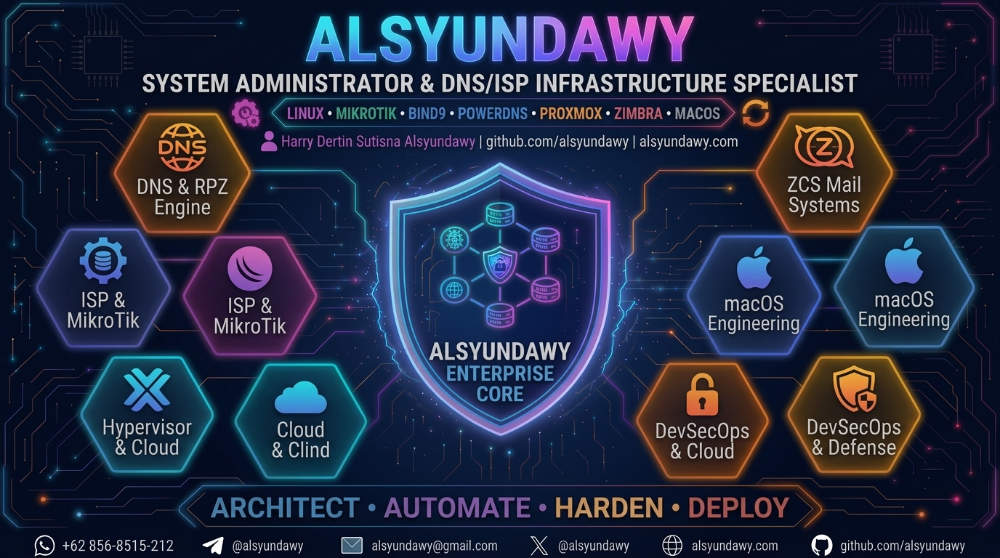

<!-- markdownlint-disable MD033 MD041 -->

  

<h2 align="center">System Administrator &amp; DNS/ISP Infrastructure Specialist 🚀</h2>

  <i>System Administrator Magang • Hypervisor, Mail &amp; DNS Infrastructure Specialist • Jakarta, ID</i>

  <b>English</b> • <a href="./README-ID.md">Bahasa Indonesia</a>

  
  
  
  
  
  
  
  
  

---

### 📖 About Me

<table border="0" width="100%">
  <tr>
    <td width="58%" valign="top">
      

        Internet addict, Windows, macOS, FreeBSD, and Linux lover. I am a <b>System Administrator &amp; System Engineer</b> (humorously styled as <i>System Administrator Magang</i>) with <b>15+ years of experience</b> specializing in ISP operations, DNS filtering architectures, mail server deployments, hypervisors, and Apple Mac technical support.
      

      

        📍 Based in <b>DKI Jakarta, Indonesia</b> • Building robust, scalable, and resilient network infrastructures.
      

      <blockquote><i>"ɪɴᴛᴇʀɴᴇᴛ ᴀᴅᴅɪᴄᴛ, ᴡɪɴᴅᴏᴡs, ᴍᴀᴄ, ꜰʀᴇᴇʙsᴅ &amp; ʟɪɴᴜx ʟᴏᴠᴇʀ — ɪ ᴀᴍ ɴᴏᴛ ᴀ ɢᴏᴏᴅ ᴍᴀɴ, ʙᴜᴛ ᴀ ᴍᴀɴ ɪɴ ᴀ ɢᴏᴏᴅ ᴅᴀʏ."</i></blockquote>
    </td>
    <td width="42%" valign="top">
      <ul>
        <li>🛠️ <b>Current Role:</b> OpisBoy | Teknisi Mac &amp; Server Keliling | DNS &amp; ISP Infrastructure Specialist</li>
        <li>🌐 <b>Portfolio &amp; Lab:</b> <a href="https://alsyundawy.com"><b>alsyundawy.com ↗</b></a></li>
        <li>💬 <b>Ask me about:</b> DNS Filtering, BIND9/PowerDNS, MikroTik RouterOS, Zimbra Mail Server, Proxmox/VMware, and macOS deployments.</li>
        <li>✉️ <b>Email:</b> <a href="mailto:alsyundawy@gmail.com">alsyundawy@gmail.com</a></li>
      </ul>
    </td>
  </tr>
</table>

  
💖 <b>QRIS Support / Dukungan QRIS</b> (Click to view QRIS payment barcode)

  

    If you find my projects and guides helpful, consider supporting ongoing development via QRIS. Thank you for your support! 🙏
      
    
  

---

### 🌐 Live Tools & Services

I host and maintain several public tools and services to assist network engineers and administrators:

| Service / Tool | Description | Status & Link |
| :--- | :--- | :---: |
| 🔍 **Looking Glass** | Enterprise-grade network diagnostic tools (Ping, Trace, MTR, BGP) | 🟢 [lg.alsyundawy.com ↗](https://lg.alsyundawy.com) |
| ⚡ **Looking Glass v2.5** | Advanced multi-engine diagnostic interface with BIRD / FRR integration | 🟢 [lgv2.php ↗](https://lg.alsyundawy.com/lgv2.php) |
| 🌐 **Looking Glass (v2.0)** | Classic lightweight diagnostic interface | 🟢 [lg.php ↗](https://lg.alsyundawy.com/lg.php) |
| 💻 **Looking Glass (v2.1)** | Alternative fast diagnostic portal | 🟢 [lgv1.php ↗](https://lg.alsyundawy.com/lgv1.php) |
| 🐙 **Looking Glass (GitHub)** | Open-source diagnostic release mirror | 🟢 [lg-github.php ↗](https://lg.alsyundawy.com/lg-github.php) |
| 📡 **MultiPing** | Multi-location ping latency & jitter analysis | 🟢 [multiping.php ↗](https://lg.alsyundawy.com/multiping.php) |
| 🛡️ **Open DNS Scanner** | Public DNS Open Resolver auditor, DDoS amplification analysis & DNSSEC validator | 🟢 [resolver.php ↗](https://lg.alsyundawy.com/resolver.php) |
| 🚀 **SpeedTest** | High-performance HTML5 bandwidth & latency benchmark | 🟢 [speedtest.alsyundawy.com ↗](https://speedtest.alsyundawy.com/) |
| 🛡️ **RBL Checker** | Real-time multi-DNSBL email blacklist checker | 🟢 [rbl.alsyundawy.com ↗](https://rbl.alsyundawy.com/) |
| 🚦 **TrustPositif Check** | Real-time Komdigi TrustPositif domain blacklist query | 🟢 [trustcheck.alsyundawy.com ↗](https://trustcheck.alsyundawy.com/) |
| 🗺️ **DNS Checker** | Global multi-server DNS propagation test | 🟢 [dnschecker.alsyundawy.com ↗](https://dnschecker.alsyundawy.com/) |
| 📦 **Custom Repository** | Personal repo hosting configuration files & packages | 🟢 [repo.alsyundawy.com ↗](https://repo.alsyundawy.com/) |
| 🧮 **Visual Subnet Calculator** | Visual IPv4 & IPv6 Subnet Planner, CIDR splitting/joining, cloud IP reservation (AWS/Azure/GCP/OCI) & zero server-side storage | 🟢 [alsyundawy.com/subnet ↗](https://alsyundawy.com/subnet/) *(Mirror: [GitHub Pages ↗](https://alsyundawy.github.io/visualsubnetcalc/))* |

---

### 📚 Technical Guides & Tutorials

Curated enterprise tutorials, server architectures, and deployment guides from [alsyundawy.com](https://alsyundawy.com):

| Category | Tutorial / Guide | Description | Guide Link |
| :--- | :--- | :--- | :---: |
| ✉️ **Mail Systems** | **Build Zimbra FOSS** | Complete guide to building Zimbra Collaboration 10.1.x FOSS from source (zm-build) for Ubuntu 24.04 & Rocky 9 | [View Guide ↗](https://alsyundawy.com/Build-Zimbra-FOSS.html) |
| ✉️ **Mail Systems** | **Install Zimbra FOSS** | Installation of Zimbra Collaboration 10.1.x FOSS on Ubuntu Server 24.04 LTS & Rocky Linux 9 / AlmaLinux 9 | [View Guide ↗](https://alsyundawy.com/Install-Zimbra-FOSS.html) |
| 🔒 **DNS & RPZ** | **TrustPositif To RPZ Binary** | BIND9 DNS filtering implementation with Komdigi RI TrustPositif RPZ, Whitelist & Google SafeSearch | [View Guide ↗](https://alsyundawy.com/TrustPositif-RPZ-Install.html) |
| 🔒 **DNS & RPZ** | **PowerDNS-Admin (Debian 13)** | Master-Slave PowerDNS Authoritative setup with PowerAdmin for ISP DNS redundancy | [View Guide ↗](https://alsyundawy.com/PowerDNS-Admin-Debian.html) |
| 🔒 **DNS & RPZ** | **PowerDNS-Admin (Ubuntu 22.04)** | Automation & deployment of PowerDNS Authoritative MariaDB with PowerDNS-Admin Flask Web UI | [View Guide ↗](https://alsyundawy.com/PowerDNS-Admin-Ubuntu.html) |
| 🔒 **DNS & RPZ** | **PHP PowerAdmin** | PowerDNS Authoritative with Poweradmin UI for zone management, DNSSEC, and REST API | [View Guide ↗](https://alsyundawy.com/PowerAdmin.html) |
| ☁️ **Hypervisors** | **Proxmox VE 9** | Installation and configuration guide for Proxmox VE 9 on Debian/Ubuntu: cluster, storage, VM & LXC | [View Guide ↗](https://alsyundawy.com/Proxmox-VE-9.html) |
| ☁️ **Hypervisors** | **vSphere Unsupported HW** | Installation and upgrade of VMware vSphere / ESXi on officially unsupported server hardware | [View Guide ↗](https://alsyundawy.com/vSphere.html) |
| 📊 **Monitoring** | **Prometheus & Grafana** | Complete infrastructure monitoring with Prometheus, Node Exporter, Grafana & Zabbix 7.0 LTS | [View Guide ↗](https://alsyundawy.com/Prometheus-Grafana-Debian.html) |
| 📊 **Monitoring** | **Cacti Monitoring Stack** | Installation of Cacti network graphing tool on Debian with Apache/Nginx on root domain | [View Guide ↗](https://alsyundawy.com/Cacti.html) |
| 🛜 **Network & Tools** | **HyperGlass** | Modern Python BGP Looking Glass with BIRD, FRR, OpenBGPD, Nginx reverse proxy & Redis integration | [View Guide ↗](https://alsyundawy.com/HyperGlass.html) |
| 🛜 **Network & Tools** | **PHP-LookingGlass** | Single-file PHP network diagnostic tool for ping, traceroute, BGP route lookup & DNS resolution | [View Guide ↗](https://alsyundawy.com/PHP-LookingGlass.html) |
| 🛜 **Network & Tools** | **phpIPAM** | phpIPAM IP Address Management for IP allocation, VLAN, subnetting, and automated network scanning | [View Guide ↗](https://alsyundawy.com/phpIPAM.html) |
| 🛡️ **VPN & Security** | **OpenVPN Road Warrior** | Deployment of OpenVPN Road Warrior dual-stack IPv4/IPv6 with Unbound DNS resolver & security hardening | [View Guide ↗](https://alsyundawy.com/OpenVPN-Install.html) |
| 🚀 **ISP Services** | **Ookla Speedtest Server** | Production Ookla Speedtest Server deployment with dual-stack IPv4 & IPv6 configuration and systemd | [View Guide ↗](https://alsyundawy.com/Ookla-Speedtest.html) |
| 📡 **PTT & Telephony** | **WalkieFleet Server** | Comprehensive guide to installing WalkieFleet Push-to-Talk (PTT) server on Linux Debian & Ubuntu | [View Guide ↗](https://alsyundawy.com/WalkieFleet.html) |
| 🧪 **Network Lab** | **Install & Deploy PNETLab v8** | Comprehensive guide to install, upgrade, and deploy PNETLab v8 Unofficial on Ubuntu 26.04: dedicated mirror, held packages & UFW | [View Guide ↗](https://alsyundawy.com/PNETLab-v8.html) |
| 🧪 **Network Lab** | **PNETLab v4 · v5 · v6 Klasik** | Comprehensive guide to install, stepwise upgrade, and deploy classic PNETLab v4/v5/v6: Bionic & Focal with rev3 script & LabHub | [View Guide ↗](https://alsyundawy.com/PNETLab-v4.html) |

---

### 🛠️ Technical Expertise

#### 🛜 ISP Hardware & System Infrastructure

  
  
  
  
  

- **Management:** Server hardware installation, MikroTik RouterOS deployment, bandwidth optimization, BGP routing, and VPN networking (WireGuard, OpenVPN).
- **Monitoring:** Smokeping, Uptime Kuma, Cacti, PRTG, Nagios, Zabbix, MRTG, Grafana, and Netdata with sub-minute intervals.

#### 🔒 DNS Filtering & Security (TrustPositif)

  
  
  
  

- **Engines:** PowerDNS, BIND9, Unbound, and Knot DNS.
- **RPZ Specialist:** Expert implementation of Response Policy Zone (RPZ) DNS firewalls and TrustPositif database (Kementerian Kominfo RI) conversion.

#### ☁️ Hypervisors & Virtualization

  
  
  
  

- **Platforms:** Proxmox VE, VMware ESXi/vSphere/vCenter, KVM, Hyper-V, QEMU.
- **Orchestration:** High-Availability (HA) clustering, live VM migrations, resource tuning, and VM backup strategies.

#### ✉️ Mail, SMTP Systems & Hosting Services

  
  
  
  

- **Platforms:** Zimbra Collaboration Suite, Proxmox Mail Gateway, WHM/cPanel, Postfix, Dovecot.
- **Securing Mail:** DKIM, SPF, DMARC alignment, Rspamd, SpamAssassin, ClamAV, and custom anti-spam filters.

#### 🍎 Apple Mac Services & Deployment

  
  

- **Expertise:** Certified macOS installation, diagnostic operations, hardware upgrades, and enterprise integration (Apple Silicon M1/M2/M3/M4 optimization).

#### 🛡️ DevSecOps & Security Hardening

  
  
  
  

- **Hardening:** Zero-CDN air-gapped runtimes, strict CSP nonce enforcement, SHA-384 Subresource Integrity, automated webshell quarantine, and malware forensic remediation.

---

### 🚀 Highlighted Repositories

#### 🛡️ DNS Infrastructure & TrustPositif Tools

- 📦 **[PowerDNS-Admin-PHP](https://github.com/alsyundawy/PowerDNS-Admin-PHP)**  
  *Enterprise Authoritative PowerDNS Web Control Plane in Native PHP & PDO — Zero external runtime frameworks, <1ms sub-millisecond bootstrap, 100% offline air-gapped Zero-CDN architecture, RFC 6238 TOTP 2FA, multi-server node clustering, APCu caching, and direct PowerDNS HTTP API v1 integration.* 
  `PHP` `PowerDNS` `DNS` `Control-Plane` `Security` `REST-API`
- 📦 **[PHP-PDNSManager](https://github.com/alsyundawy/PHP-PDNSManager)**  
  *Enterprise DNS Management Web GUI & REST API Gateway for PowerDNS Authoritative Server — PHP 8.1+, PSR-compliant architecture, RBAC, and high-performance zone automation.* 
  `PHP` `PowerDNS` `DNS` `REST-API` `Enterprise`
- 📦 **[PHP-BindManager](https://github.com/alsyundawy/PHP-BindManager)**  
  *Enterprise-grade Web GUI for BIND9 DNS Server Management — PHP 8.4+, Bootstrap 5, Tailwind CSS, SQLite3, RBAC, DNSSEC, REST API.* 
  `PHP` `BIND9` `DNS` `DNSSEC` `REST-API`
- 📦 **[TrustPositif-To-RPZ-Binary](https://github.com/alsyundawy/TrustPositif-To-RPZ-Binary)**  
  *Converts Kominfo TrustPositif domains into DNS RPZ format. Features whitelist & Google SafeSearch helper.* 
  `Go` `DNS` `RPZ` `Blocklist`
- 📦 **[TrustPositif](https://github.com/alsyundawy/TrustPositif)**  
  *Comprehensive raw TrustPositif domain database with daily automated updates.* 
  `Database` `Kominfo` `Blocklist`
- 📦 **[TrustPositif-Validator](https://github.com/alsyundawy/TrustPositif-Validator)**  
  *High-performance domain validation and aggregation pipeline for TrustPositif/Komdigi and public blocklists. ShellCheck Certified.* 
  `Shell` `Validator` `RFC-Compliant` `Punycode`
- 📦 **[sunat-trustpositif](https://github.com/alsyundawy/sunat-trustpositif)**  
  *Shell script that validates domain lists against official TLDs and cleanses database records.* 
  `Shell` `TLD` `Data-Cleansing`
- 📦 **[StevenBlack-Host-RPZ](https://github.com/alsyundawy/StevenBlack-Host-RPZ)**  
  *Converts the StevenBlack host lists to DNS RPZ format.* 
  `DNS` `RPZ` `StevenBlack`
- 📦 **[dns-blocklists](https://github.com/alsyundawy/dns-blocklists)**  
  *Fork of Hagezi DNS-Blocklists for safe browsing.* 
  `DNS` `Blocklist` `Hagezi`
- 📦 **[Sefinek-Blocklist-Collection](https://github.com/alsyundawy/Sefinek-Blocklist-Collection)**  
  *A comprehensive compilation of block lists for Pi-hole and AdGuard with over 5 million domains.* 
  `Pi-hole` `AdGuard` `Blocklist`

#### 🖥️ Diagnostics, IPAM & Network Automation

- 📦 **[visualsubnetcalc](https://github.com/alsyundawy/visualsubnetcalc)**  
  *Visual Subnet Calculator — Modernized & Hardened Edition. Visual, interactive IPv4 subnet calculator and network design utility with real-time bit splitting, CIDR calculations, and network mapping.* 
  `TypeScript` `Networking` `Subnetting` `IPv4` `CIDR`
- 📦 **[SubnetCalc-MacOS](https://github.com/alsyundawy/SubnetCalc-MacOS)**  
  *High-Performance, Native Swift & Cocoa IPv4 & IPv6 Subnet Calculator for macOS (Universal 2: Apple Silicon M1-M4 & Intel x64). Features 25 iconic developer theme suites, hierarchical menu navigation, CIDR/VLSM calculation, and wildcard masks.* 
  `Swift` `macOS` `Apple-Silicon` `AppKit` `Cocoa` `Subnetting` `IPAM`
- 📦 **[SubNetCalc-Electron](https://github.com/alsyundawy/SubNetCalc-Electron)**  
  *High-Precision, Low-Footprint IPv4 & IPv6 Subnet Calculator with 14 Multi-Themes for macOS & Cross-Platform desktop. Powered by Electron 44, Node 24, React 19, and TypeScript with real-time RFC classification and binary bit visualization.* 
  `TypeScript` `Electron` `React` `Networking` `Subnetting` `Cross-Platform`
- 📦 **[bailu-kilo-agent](https://github.com/alsyundawy/bailu-kilo-agent)**  
  *Agentic coding sidebar for BAILU AI — Kilo-style panel, model picker, Auto, thinking mode, and API token integration for VS Code & Code-OSS forks.* 
  `TypeScript` `VSCode` `AI-Agent` `Agentic-Coding` `Extension`
- 📦 **[php-looking-glass](https://github.com/alsyundawy/php-looking-glass)**  
  *A professional, secure, single-file PHP Looking Glass for network diagnostics (Ping, Traceroute, MTR, WHOIS, DNS Lookup, Iperf3).* 
  `PHP` `Network` `Looking-Glass` `MTR`
- 📦 **[MIKROTIK-SCRIPT](https://github.com/alsyundawy/MIKROTIK-SCRIPT)**  
  *Curated collection of useful Mikrotik scripting automations.* 
  `RouterOS` `MikroTik` `Automation`
- 📦 **[mikrotik-blacklist](https://github.com/alsyundawy/mikrotik-blacklist)**  
  *RouterOS scripts for automated threat intelligence blacklist updates.* 
  `RouterOS` `Blacklist` `Security`
- 📦 **[bind-acl-indonesia-openixp](https://github.com/alsyundawy/bind-acl-indonesia-openixp)**  
  *Automatically generates Indonesian IP ACL files for BIND9 DNS using Nice.rsc and APNIC.* 
  `BIND9` `ACL` `OpenIXP` `APNIC`
- 📦 **[dnsperftest](https://github.com/alsyundawy/dnsperftest)**  
  *Comprehensive DNS benchmark and latency evaluation tool.* 
  `DNS` `Benchmark` `Latency`
- 📦 **[ufw-ipset-blocklist-autoupdate](https://github.com/alsyundawy/ufw-ipset-blocklist-autoupdate)**  
  *Automatically updates IP blocking lists via ipset and ufw firewalls.* 
  `UFW` `Ipset` `Security`
- 📦 **[PowerDNS-Zone-Backups](https://github.com/alsyundawy/PowerDNS-Zone-Backups)**  
  *Automated PowerDNS zone backup solution with incremental backups.* 
  `PowerDNS` `Backup` `Database`
- 📦 **[nginx-reverse-proxy-cluster](https://github.com/alsyundawy/nginx-reverse-proxy-cluster)**  
  *High-availability Nginx reverse proxy & load balancing cluster architecture with SSL termination, HTTP/2, and rate limiting.* 
  `Nginx` `Reverse-Proxy` `Load-Balancing` `High-Availability` `Security`
- 📦 **[isp-billing-radius](https://github.com/alsyundawy/isp-billing-radius)**  
  *FreeRADIUS and MikroTik API integration module for automated ISP subscriber bandwidth provisioning and billing.* 
  `FreeRADIUS` `MikroTik` `ISP` `Billing` `Network-Engineering`

#### ✉️ Mail Systems & Zimbra Collaboration Suite

- 📦 **[eradicate-zimbra-malware](https://github.com/alsyundawy/eradicate-zimbra-malware)**  
  *Enterprise Forensic Incident Response, Anti-Ransomware, Polyglot Webshell Quarantine & Zimbra Permission Healing Suite.* 
  `Shell` `Security` `Forensics` `Zimbra` `Incident-Response`
- 📦 **[Zimbra-Link-Installer](https://github.com/alsyundawy/Zimbra-Link-Installer)**  
  *The Complete Zimbra Collaboration Archive & Installer Suite. Direct binary downloads, official & community builds, cryptographic checksums, and automated CLI installer (ZCS 4.5.x – 10.1.x).* 
  `Shell` `HTML` `Zimbra` `Installer` `Mail-Server`
- 📦 **[Zimbra2Zimbra-Migration-Tool](https://github.com/alsyundawy/Zimbra2Zimbra-Migration-Tool)**  
  *Z2Z — Zimbra to Zimbra Migration Suite. Enterprise zero-timeout, cross-version, and zero-data-loss migration engine for Zimbra Collaboration Suite (ZCS 7.x – 10.1.x) & Carbonio CE.* 
  `Shell` `Zimbra` `Migration` `Backup` `Mail-Server`
- 📦 **[zmbackup](https://github.com/alsyundawy/zmbackup)**  
  *Enterprise Multi-Threaded Hot Backup, Zero-Timeout Restore, Cross-OS Migration Engine & Security Hardening for Zimbra Collaboration Suite (ZCS 7.0–10.1.x Daffodil) & Carbonio FOSS.* 
  `Shell` `Zimbra` `Backup` `Disaster-Recovery` `Migration`
- 📦 **[Z2C (Zimbra to Carbonio Migration)](https://github.com/alsyundawy/Z2C)**  
  *Zimbra to Carbonio Migration tool. A set of scripts to export domains, accounts, aliases, and mailboxes, supporting parallel migration.* 
  `Shell` `Zimbra` `Carbonio` `Migration`
- 📦 **[Zimbra-Clean-Spam](https://github.com/alsyundawy/Zimbra-Clean-Spam)**  
  *Scan and purge spam email queues caused by compromised accounts.* 
  `Zimbra` `Mail-Server` `Spam-Cleaner`
- 📦 **[uninstall-zimbra](https://github.com/alsyundawy/uninstall-zimbra)**  
  *Complete Bash utility to clean-uninstall Zimbra instances from Linux.* 
  `Zimbra` `Uninstaller` `Bash`

#### ☁️ Hypervisors, macOS & System Utilities

- 📦 **[pear-desktop-mac](https://github.com/alsyundawy/pear-desktop-mac)**  
  *High-performance, privacy-hardened macOS desktop client for YouTube Music with built-in ad blocker (27+ vendor filters), SponsorBlock, synced lyrics & native plugins.* 
  `macOS` `Apple-Silicon` `YouTube-Music` `Electron` `TypeScript`
- 📦 **[PnetLab-v8](https://github.com/alsyundawy/PnetLab-v8)**  
  *Enterprise network virtualization & emulation platform on Ubuntu 26.04 LTS (Resolute). Turn-key OVA, ISO, and Proxmox VE 8+ deployment guide.* 
  `Ubuntu` `Proxmox` `Virtualization` `Network-Emulation` `PNETLab` `KVM`
- 📦 **[Disable-MacOS-Updates](https://github.com/alsyundawy/Disable-MacOS-Updates)**  
  *Reversible Bash scripts to disable automatic software updates on macOS (Monterey to Golden Gate).* 
  `macOS` `Bash` `Apple-Silicon` `DAW` `Sysadmin`
- 📦 **[openssl-1.0.2](https://github.com/alsyundawy/openssl-1.0.2)**  
  *Production-grade security hardened fork and backported CVE mitigations for legacy OpenSSL 1.0.2 (up to 1.0.2zr).* 
  `C` `OpenSSL` `Security` `Hardening` `CVE-Mitigation` `Backport`
- 📦 **[esxi-unlocker-v4](https://github.com/alsyundawy/esxi-unlocker-v4)**  
  *macOS Unlocker V4 for VMware ESXi. Enables Apple macOS guest support on VMware ESXi hypervisors with maintained shell/Python patching workflow and VMware Tools integration.* 
  `Python` `VMware` `ESXi` `macOS` `Hypervisor`
- 📦 **[Microsoft-Office-For-MacOS](https://github.com/alsyundawy/Microsoft-Office-For-MacOS)**  
  *Complete Mac installer bundle for Microsoft Office (Intel/Apple Silicon) with LTSC serializer.* 
  `macOS` `Installer` `Office` `Apple-Silicon`
- 📦 **[skipmdm-bypass](https://github.com/alsyundawy/skipmdm-bypass)**  
  *Automatic MDM bypass scripts for Monterey, Ventura, and Sonoma macOS.* 
  `macOS` `MDM-Bypass` `Shell`
- 📦 **[shc](https://github.com/alsyundawy/shc)**  
  *Generic Shell Script Compiler with Enhanced Security & Auditing. Encrypts and compiles shell scripts into stripped binary executables.* 
  `C` `Shell` `Security` `Auditing` `Hardening`
- 📦 **[File-Directory-Browser](https://github.com/alsyundawy/File-Directory-Browser)**  
  *PHP File browser featuring advanced security (CSRF protection, output sanitization, hash checks).* 
  `PHP` `Security` `File-Manager`
- 📦 **[NotepadNext-MacOS](https://github.com/alsyundawy/NotepadNext-MacOS)**  
  *Reimplementation of Notepad++ for macOS.* 
  `macOS` `NotepadNext` `Editor`
- 📦 **[XiaomiADBFastbootTools-Win32](https://github.com/alsyundawy/XiaomiADBFastbootTools-Win32)**  
  *ADB and fastboot tools optimized for Xiaomi devices on Windows.* 
  `Windows` `ADB` `Fastboot` `Xiaomi`
- 📦 **[macos-pro-tweaks](https://github.com/alsyundawy/macos-pro-tweaks)**  
  *Production-grade macOS developer environment setup, system tuning, and hidden defaults configuration scripts.* 
  `macOS` `Shell` `Developer-Tools` `System-Tuning` `Automation`

---

### 🛡️ Security Architecture & Quality Standards (13 Pillars)

The software and infrastructure in this repository adhere to rigorous enterprise standards grounded in **OWASP Top 10:2025**, **CWE Top 25**, and defensive systems engineering:

1. **Strict Content-Security-Policy (CSP) & Zero-CDN Architecture**: 100% self-hosted, offline-capable designs with cryptographic nonce protection and zero external third-party CDN attack surfaces.
2. **Subresource Integrity (SRI)**: SHA-384 cryptographic hashes guarding every local asset and bundle against tamper risks.
3. **Cross-Origin Isolation**: Protected with `Cross-Origin-Opener-Policy: same-origin` and `Cross-Origin-Resource-Policy: same-origin`.
4. **Hardware Safe-Area Inset Handling**: Native CSS dynamic inset handling (`env(safe-area-inset-*)`) preventing viewport clipping on notched and camera punch-hole screens.
5. **Anti-Font Boosting Optimization**: Hardened against Android WebKit layout corruption across Xiaomi Redmi MIUI and POCO HyperOS devices.
6. **Zero Horizontal Overflow**: Verified via automated multi-device responsive test suites across 20 distinct hardware viewport profiles with 0px overflow.

---

### 🏢 Industry Partners & Client Ecosystem

Trusted by **56+ Internet Service Providers (ISPs), network operators, and enterprises** across Indonesia for authoritative DNS architectures, BGP routing, virtualization clusters, and mission-critical mail recovery operations.

---

### 📊 GitHub Analytics

  
  

  
  

  

---

<b>📋 Documentation Notes & Changelog</b>

### Version 2.7.0 (October 6, 2026)

- **High-Tech Cyber Developer Banner Flyer**: Upgraded hero banner to high-resolution (1376x768) cyber circuitry flyer (`banner.jpeg`) matching `PowerDNS-Admin-PHP` visual aesthetics, featuring glowing neon PCB traces, dual-neon shield crest, 6 hexagonal capability nodes, and integrated contact endpoints.
- **Enriched 40-Repository Showcase Matrix**: Integrated full catalog of 40 production repositories across DNS infrastructure, diagnostic telemetry, Zimbra collaboration suite, and hypervisor/macOS engineering (including `nginx-reverse-proxy-cluster`, `isp-billing-radius`, and `macos-pro-tweaks`).
- **DevSecOps Pillar & 13-Pillar Security Invariants**: Added DevSecOps expertise pillar and detailed architectural security standards (strict CSP, SHA-384 SRI, zero-CDN, and Xiaomi/POCO anti-font boosting).
- **Client Ecosystem Integration**: Documented operational footprint trusted by 56+ Internet Service Providers (ISPs) and enterprise partners in Indonesia.
- **Bilingual Documentation**: Established default English specification (`README.md`) and Indonesian edition (`README-ID.md`).
- **QRIS Donation Flow**: Replaced Ko-fi button with dedicated in-page QRIS donation anchor.
- **Strict Linter Verification**: Validated 100% compliance across `markdownlint-cli` with 0 errors and 0 warnings.

### Version 2.6.0 (October 6, 2026)

- **New Highlighted Repositories**: Integrated 3 production-grade open-source repositories:
  - `PowerDNS-Admin-PHP` — Enterprise Authoritative PowerDNS Web Control Plane in Native PHP & PDO with sub-millisecond bootstrap, Zero-CDN architecture, RFC 6238 TOTP 2FA & PowerDNS API v1 integration.
  - `SubnetCalc-MacOS` — High-performance native Swift & AppKit Cocoa IPv4/IPv6 subnet calculator for macOS Universal 2 (Apple Silicon M1-M4 & Intel x64) with 25 developer theme suites.
  - `SubNetCalc-Electron` — High-precision, low-footprint IPv4/IPv6 subnet calculator with 14 multi-themes for macOS and cross-platform desktop built with Electron 44, React 19 & TypeScript.
- **Metadata Synchronization**: Harmonized repository descriptions, badges, and documentation across GitHub profile and portfolio indexes.

### Version 2.5.0 (September 23, 2026)

- **New Highlighted Repositories**: Integrated production-grade open-source repositories:
  - `pear-desktop-mac` — High-performance, privacy-hardened macOS desktop client for YouTube Music with built-in ad blocker (27+ vendor filters), SponsorBlock & synced lyrics.
  - `PnetLab-v8` — Enterprise network virtualization & emulation platform on Ubuntu 26.04 LTS (Resolute) with turn-key Proxmox VE 8+ & VMware deployment.
  - `Disable-MacOS-Updates` — Reversible Bash scripts to disable automatic software updates on macOS (Monterey to Golden Gate).
  - `openssl-1.0.2` — Production-grade security hardened fork and backported CVE mitigations for legacy OpenSSL 1.0.2 (up to 1.0.2zr).
- **Metadata Synchronization**: Harmonized repository descriptions and topics across GitHub metadata and portfolio indexes.

### Version 2.4.0 (September 21, 2026)

- **New Live Network Utility**: Added `Visual Subnet Calculator` (`alsyundawy.com/subnet`) with mirror (`alsyundawy.github.io/visualsubnetcalc`) for visual IPv4 & IPv6 CIDR/VLSM subnet planning and cloud IP reservation.
- **New Technical Tutorials**: Integrated 2 comprehensive deployment guides from `alsyundawy.com`:
  - `Install & Deploy PNETLab v8` (Ubuntu 26.04)
  - `Install & Deploy PNETLab v4 · v5 · v6 Klasik` (Ubuntu Bionic & Focal)
- **New Highlighted Repositories**: Integrated 3 production-grade open-source repositories:
  - `PHP-PDNSManager` — Enterprise DNS Management Web GUI & REST API Gateway for PowerDNS.
  - `bailu-kilo-agent` — Agentic coding sidebar for BAILU AI for VS Code & Code-OSS forks.
  - `PHP-BindManager` — Enterprise-grade Web GUI for BIND9 DNS Server Management.
- **Code Review & Quality Hardening**: Verified all 13 code review checklist dimensions (Bug, Syntax, Runtime, Logic, Memory, Dead Code, Duplicate Code, Circular Dependency, Performance Bottleneck, Security Vulnerability, Maintainability, Scalability, Readability) with zero defects.

### Version 2.3.0 (September 17, 2026)

- **Repository Expansion & Architecture**: Added and categorized 7 key enterprise repositories (`visualsubnetcalc`, `esxi-unlocker-v4`, `Zimbra-Link-Installer`, `eradicate-zimbra-malware`, `zmbackup`, `shc`, and `Zimbra2Zimbra-Migration-Tool`) into four dedicated operational pillars.
- **Live Diagnostics & Services**: Added `Open DNS Scanner` (`lg.alsyundawy.com/resolver.php`) with modern operational status indicators (`🟢`) for real-time DNS telemetry and DDoS amplification evaluation.
- **Production Guides Directory**: Integrated a curated directory of 16 technical tutorials and deployment manuals from `alsyundawy.com`.
- **Analytics Resilience & Patch**: Replaced rate-limited Vercel instances with high-availability verified mirrors (`github-readme-stats-eight-theta` and official `streak-stats.demolab.com`).
- **Linter & Whitespace Optimization**: Converted trailing space line breaks to clean HTML ` ` tags to achieve 100% compliance with zero Trunk linter warnings.
- **Aesthetic Refinement**: Enhanced header presentation, typography, badges, and link styling for a modern enterprise Look-and-Feel.

### Version 2.2.0 (July 19, 2026)

- **Repository Integration**: Added audit-hardened shell compiler (`shc`) and `Zimbra to Carbonio Migration` (`Z2C`) to Highlighted Repositories.
- **Standardized Formatting**: Cleaned up Markdown lint warnings (MD012, MD022, MD032, MD041) for optimal rendering and accessibility.
- **Visual Rebranding**: Added a custom, modern high-tech dark theme banner at the top (`banner.jpeg`).
- **Aesthetic Refinement**: Redesigned layout to utilize a professional double-column introduction.
- **Collapsible QRIS**: Moved the QRIS donation layout into an elegant collapsible section to keep the main landing view clean.
- **Dynamic Repository Badges**: Added live shields.io GitHub Star badges to all highlighted repositories.
- **Unified Analytics**: Standardized all GitHub summary, streak, stats, and language cards to the modern `tokyonight` theme and aligned them in a responsive layout.
- **Interactive Emojis**: Replaced basic bullets with expressive, attractive, and professional emojis.

### Version 2.1.0 (July 5, 2026)

- **Expanded Profile Data**: Integrated additional background and details from `alsyundawy.com`, including the user's self-styled identity as *System Administrator Magang / OpisBoy / Teknisi Mac & Server Keliling*.
- **Comprehensive Repository Expansion**: Scraped GitHub and added missing highly starred and notable projects (`MIKROTIK-SCRIPT`, `CleanMyMacX-MAS`, `dns-blocklists`, `Sefinek-Blocklist-Collection`, `skipmdm-bypass`, `ufw-ipset-blocklist-autoupdate`, `PowerDNS-Zone-Backups`, `NotepadNext-MacOS`, `XiaomiADBFastbootTools-Win32`).
- **Looking Glass Mirrors**: Added the multiple Looking Glass version endpoints (v2.0, v2.1, and GitHub version) in the live services table.
- **Mirror & Counter Patch**: Replaced rate-limited endpoints for *Top Languages*, *Trophies*, and *Visitor Count* with active, verified service endpoints (`github-readme-stats-sigma-five`, `github-profile-trophy-unserori`, and `komarev-ghpvc`).
- **Restored Components**: Restored the original QRIS donation graphic and the Star History chart.
- **Markdown Linting**: Resolved standard validation issues including heading level structure, list formats, and margin spacing.
- **Aesthetic Refinement**: Re-organized contact badges and technical categories to follow modern responsive practices.

---

  

  <i>You Are Awesome • ༺ Harry DS Alsyundawy ༻ • Hardline & Militant Lying Around</i>

  

